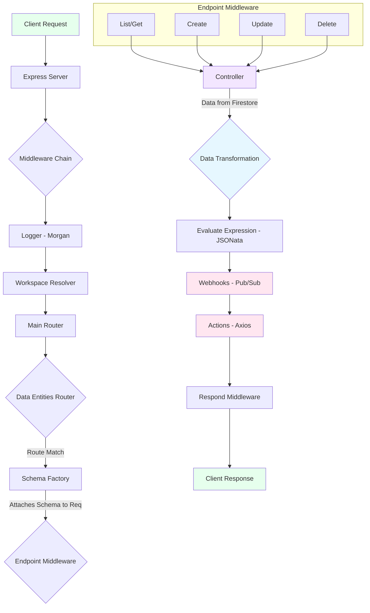

# Blue Harvest Services - Technical Documentation


## 1. Overview

Blue Harvest Services is a highly dynamic, schema-driven, multi-tenant REST API built with Node.js, Express, and TypeScript. It leverages Google Cloud Firestore as its primary database and integrates with Google's Vertex AI for powerful vector-based similarity searches.

The core design principle of this service is to provide a generic and extensible data management platform where new API endpoints and their corresponding data structures can be defined on-the-fly by creating schemas, without requiring code changes or deployments.

### Key Features

* **Dynamic Entity & Schema Management**: Define new data entities and their validation schemas through a dedicated API. The service automatically generates corresponding API endpoints.
* **Vector Search with AI**: Utilizes Google's Vertex AI and Genkit to automatically create text embeddings for searchable fields, enabling powerful semantic search capabilities on your data entities.
* **Automated API Documentation**: Dynamically generates and serves a comprehensive OpenAPI (Swagger) specification and a user-friendly Redoc interface.
* **Extensible Middleware Pipeline**: Employs a robust middleware chain for handling caching, logging, data validation, transformation, webhooks, and actions.
* **Multi-Tenancy Support**: Designed with multi-tenancy in mind, using the request's hostname as a `workspace` to partition data in Firestore.
* **Asynchronous Webhooks & Actions**: Triggers asynchronous webhooks via Google Cloud Pub/Sub and can chain sequential POST requests (actions) after data modification events (Create, Update, Delete).

---

## 2. Architecture & Core Concepts

The application follows a modular, middleware-centric architecture. Each incoming request passes through a series of specialized middleware functions that enrich the request, perform validation, and handle the core business logic before a final response is sent.

### Request Lifecycle Diagram



### Core Components

1.  **Workspace**: A workspace is the primary data container, representing a single tenant. By default, it's derived from the request hostname but can be overridden by environment variables. All data, schemas, and configurations are scoped to a workspace.

2.  **Data Entity**: A top-level resource in the API (e.g., `products`, `customers`). Each data entity has its own set of objects, schemas, expressions, webhooks, and actions stored in dedicated Firestore sub-collections.

3.  **Schemas (AJV)**: The heart of the system's dynamism. Schemas are defined using JSON Schema standards and stored in Firestore. They are used by the `schemaFactory.mdw` middleware to:
    * Validate incoming request bodies for `POST` and `PATCH` requests.
    * Validate outgoing data before sending a response.
    * Introspect properties to determine which fields are filterable, searchable, or serve as the unique `objectId`.
    * The system uses **AJV** for high-performance validation and supports custom keywords like `filter`, `searchable`, and `objectId`.

4.  **Controllers**: These are the data access layer. They are responsible for all direct interactions with Firestore and the cache, including:
    * `create.controller.ts`: Handles document creation and text embedding.
    * `get.controller.ts`: Fetches a single document, with caching.
    * `list.controller.ts`: Builds and executes complex queries, including vector searches.
    * `update.controller.ts`: Manages document updates and re-embedding.
    * `delete.controller.ts`: Handles document deletion.
    * `cache.controller.ts`: An abstraction layer for Memcached.

5.  **Middleware Pipeline**:
    * `workspace.mdw.ts`: Resolves the current workspace and initializes the Firestore DB instance for the request.
    * `schemaFactory.mdw.ts`: The most critical middleware. It loads the appropriate schemas for the requested data entity from a cache or Firestore and attaches compiled validation functions to the request object (`req.objectSchema`, `req.listSchema`).
    * `evaluateExpression.mdw.ts`: If an `?expression=` query parameter is present, this middleware transforms the response data using a stored JSONata expression.
    * `webhooks.mdw.ts`: After a data modification, this publishes events to a Google Cloud Pub/Sub topic to trigger external webhooks asynchronously.
    * `actions.mdw.ts`: Executes a sequence of dependent HTTP POST requests, where the output of one action serves as the input for the next.

---

## 3. Repository Structure

The repository is organized with a clear separation of concerns, primarily within the `src/` directory.

```
.
├── .vscode/
│   ├── launch.json       # VSCode debugger configuration for Nodemon
│   └── settings.json     # VSCode settings for auto-format and fix on save
├── src/
│   ├── assets/           # Static assets, including custom CSS for Swagger UI
│   ├── constants/        # String constants for errors, headers, paths, etc.
│   ├── controllers/      # Core logic for data interaction (Firestore, Cache, AI)
│   ├── handlers/         # Helper functions and handlers, like cache refreshing
│   ├── middlewares/      # Express middleware pipeline components
│   │   ├── dataEntities/ # Middleware for the main data entity routes
│   │   ├── schemas/      # Middleware for schema management routes
│   │   ├── utils/        # Utility middleware (error handler, logger)
│   │   └── workspace/    # Workspace resolution middleware
│   ├── routers/          # Express router definitions
│   ├── schemas/          # Base schemas for system objects (actions, webhooks) and AJV setup
│   └── types/            # TypeScript type definitions and custom Error class
├── .env.example          # Example environment file
├── .gitignore            # Standard Node.js gitignore
├── eslint.config.js      # ESLint configuration for code quality
├── nodemon.json          # Nodemon configuration for development
├── package.json          # Project dependencies and scripts
└── tsconfig.json         # TypeScript compiler options
```

---

## 4. Getting Started

Follow these steps to set up and run the application locally.

### Prerequisites

* **Node.js**: Version 22.x or later.
* **Google Cloud SDK**: The `gcloud` CLI tool, authenticated with a project that has Firestore and Vertex AI enabled.
* **Memcached**: A local or remote Memcached instance for caching. Run `memcached` in a separate terminal for local setup.

### Installation

1.  **Clone the repository:**
    ```bash
    git clone [https://github.com/your-repo/blue-harvest-services.git](https://github.com/your-repo/blue-harvest-services.git)
    cd blue-harvest-services
    ```

2.  **Install dependencies:**
    ```bash
    npm install
    ```

### Environment Configuration

Create a `.env` file in the root of the project by copying the `.env.example` file. Fill in the following variables as needed:

| Variable                 | Description                                                                    | Default           |
| :----------------------- | :----------------------------------------------------------------------------- | :---------------- |
| `PORT`                   | The port the Express server will run on.                                       | `8080`            |
| `CORS_ORIGIN`            | The allowed origin for CORS requests.                                          | `*`               |
| `LOGING_MODE`            | The Morgan logging format string.                                              | `:date[iso]...`     |
| `OVERRIDE_WORKSPACE`     | Statically sets the workspace, overriding the hostname. Useful for local dev.  | ` ` (empty)       |
| `OVERRIDE_DB_INSTANCE`   | The database ID for Firestore.                                                 | `blue-harvest`    |
| `WEBHOOKS_TOPIC`         | The name of the Google Cloud Pub/Sub topic for publishing webhook events.        | ` ` (empty)       |
| `CACHE_TTL`              | The standard time-to-live for cache entries in seconds.                        | `172800` (48 hours) |
| `CACHE_IP`               | The IP address and port for the Memcached server.                              | `127.0.0.1:11211` |

### Running the Application

* **Development Mode:**
    This command uses `nodemon` to watch for file changes in the `src/` directory, automatically recompiles the TypeScript, and restarts the server.
    ```bash
    npm run dev
    ```

* **Production Mode:**
    First, build the TypeScript code into JavaScript in the `dist/` directory, then start the application.
    ```bash
    npm run build
    npm run start
    ```

### Debugging

The project includes a VS Code launch configuration for debugging the TypeScript application with Nodemon. Simply open the project in VS Code and start the "Nodemon TS" debugger from the "Run and Debug" panel.

---

## 5. API Documentation

The service provides self-generating API documentation. Once the server is running, you can access it at:

* **Endpoint**: `http://localhost:8080/api/dataEntities/docs`
* **Powered by**: Redoc and a dynamically generated `openApi.json` file.

The documentation is built by the `openApiSchemaGen.mdw.ts` middleware, which introspects all schemas stored in Firestore for every data entity and constructs a complete OpenAPI v3.1.0 specification. This means that as soon as you create or update a schema, the API documentation reflects those changes instantly.

---

## 6. Best Practices & Code Quality

The repository adheres to several best practices to ensure code quality, maintainability, and performance.

* **Linting and Formatting**: ESLint and Prettier are configured to enforce a consistent code style. ESLint rules are defined in `eslint.config.js` and include strict checks like requiring explicit return types and disallowing `any`. VS Code is configured to auto-format and fix linting errors on save.

* **TypeScript Strictness**: The `tsconfig.json` enables strict compiler options, including `noUnusedLocals`, `noUnusedParameters`, and `noImplicitReturns`, to catch common errors at compile time.

* **Modular Routers**: The API routing is broken down into modular pieces using Express Routers (`main.router.ts`, `dataEntities.router.ts`, etc.), making the API structure easy to navigate and extend.

* **Centralized Error Handling**: A custom `iError` class (`src/types/error.ts`) is used throughout the application to throw errors with specific status codes and data payloads. A global `errorHandler` middleware (`src/middlewares/utils/error.mdw.ts`) catches all errors and formats them into a consistent JSON response, preventing stack traces from leaking to the client.

* **Caching Strategy**: The application uses a multi-layered caching strategy:
    1.  **In-Memory Cache (NodeCache)**: `workspaceCache` holds data entity configurations (schemas, expressions, etc.) to avoid repeated Firestore reads for the same entity within a short period. It is refreshed by the `refreshDataEntityCache.handler`.
    2.  **Distributed Cache (Memcached)**: The `cache.controller` provides an interface to Memcached for caching the results of expensive database queries, such as document gets and lists.
 

# Blue Harvest Services: In-Depth Functionality Guide

Deep dive into the core mechanics and advanced functionalities of the Blue Harvest Services platform. It is intended for developers who will be building upon, maintaining, or integrating with the service.

* [Asynchronous Events: Webhooks](./guides/asynchronousEventsWebhooks.md)
* [Data Transformation with Expressions](./guides/dataTransformationWithExpressions.md)
* [Dynamic Data Querying & Manipulation](./guides/dynamicDataQueryingAndManipulation.md)
* [Schema-Driven Core](./guides/schemaDrivenCore.md)
* [Actions](./guides/synchronousEventsActions.md)

---
