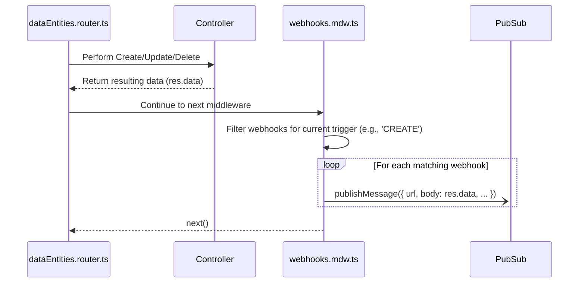

## Asynchronous Events Webhooks

The platform supports two types of event-driven automation that fire after a create, update, or delete operation: **Webhooks** and **Actions**. Both are triggered after the primary database operation is complete and do not block the API response to the client.

### Webhooks

Webhooks are designed for simple, asynchronous "fire-and-forget" notifications to external systems.

* **Mechanism**: The `webhooks.mdw.ts` middleware is triggered on `POST`, `PATCH`, and `DELETE` routes.
* **Logic**:
    1.  It retrieves all webhook configurations for the entity from the `workspaceCache`.
    2.  It filters the webhooks to find those that match the current operation (e.g., `CREATE`, `UPDATE`).
    3.  For each matching webhook, it constructs a JSON payload containing the workspace, entity, trigger type, and the data from the response.
    4.  It publishes this payload as a message to a Google Cloud Pub/Sub topic defined by the `WEBHOOKS_TOPIC` environment variable. This is an extremely fast operation that offloads the actual HTTP request to a separate background worker (e.g., a Cloud Function) that subscribes to the topic.

