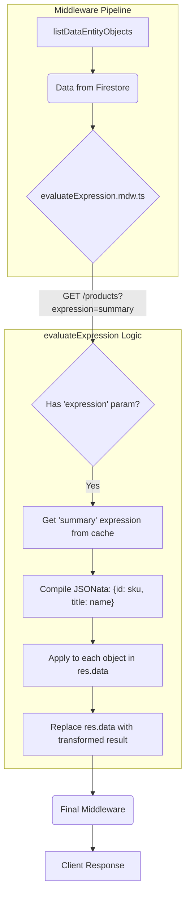

## Data Transformation with Expressions

Expressions provide a powerful way to transform data on the server side before it is returned to the client, using the **JSONata** query and transformation language. This allows for complex data reshaping, calculations, and conditional logic without requiring new API versions.

### How It Works

1.  **Configuration**: Expressions are stored in Firestore under a data entity's `expressions` sub-collection. Each expression has a unique ID and a JSONata string.
2.  **Invocation**: A client requests a transformation by adding the `?expression=<expressionId>` query parameter to a `GET` request.
3.  **Execution**: The `evaluateExpression.mdw.ts` middleware runs after the data has been fetched from Firestore.
    * It retrieves the requested expression from the in-memory `workspaceCache`.
    * It compiles the JSONata string into an executable function.
    * It applies this function to the `res.data` (which can be a single object or an array of objects).
    * The original `res.data` is replaced with the transformed result.
    * A response header `X-EXPRESSION` is added to indicate which transformation was applied.

---
