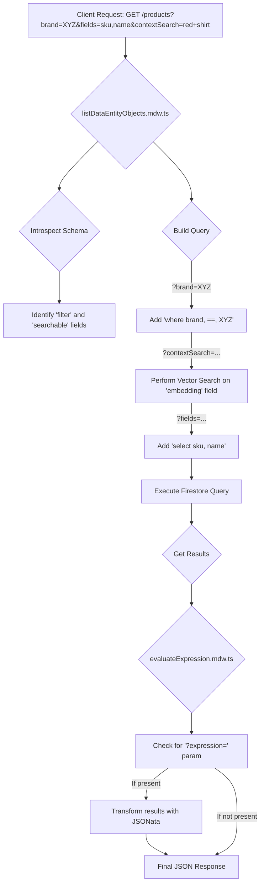

## Dynamic Data Querying & Manipulation

The `GET` endpoints are designed to be highly flexible, allowing clients to shape the data they receive through query parameters. This logic is primarily handled in `listDataEntityObjects.mdw.ts` and `evaluateExpression.mdw.ts`.

### Query Parameter Breakdown

* **Filtering (e.g., `?brand=MyBrand&category=Apparel`)**
    * **Mechanism**: The `listDataEntityObjects.mdw.ts` middleware retrieves the active schema, identifies all properties with `"filter": true`, and checks if any of the query parameters match these properties.
    * **Logic**: For each valid filter parameter, it dynamically adds a `.where(key, '==', value)` clause to the Firestore query. This ensures that clients cannot filter on un-indexed or sensitive fields.

* **Partial Responses (`?fields=sku,name,price`)**
    * **Mechanism**: This parameter takes a comma-separated list of field names.
    * **Logic**: If the `fields` parameter is present, the middleware adds a `.select(...)` clause to the Firestore query. This is a crucial optimization that reduces document read costs in Firestore and minimizes the network payload size sent to the client.

* **Vector Similarity Search (`?contextSearch=red+running+shoe`)**
    * **Mechanism**: This parameter triggers a completely different query path within `list.controller.ts`.
    * **Logic**:
        1.  The `contextSearch` text is sent to the `embeddings.controller.ts`.
        2.  The controller generates a query vector using the Vertex AI `text-embedding-004` model, configured for `RETRIEVAL_QUERY`.
        3.  Instead of a standard `get()`, the controller executes a `findNearest()` query on the collection. It searches against the `embedding` field that was automatically generated for each document from its `searchable` properties.
        4.  This returns the documents that are most semantically similar to the query text, rather than just relying on keyword matches.

---
