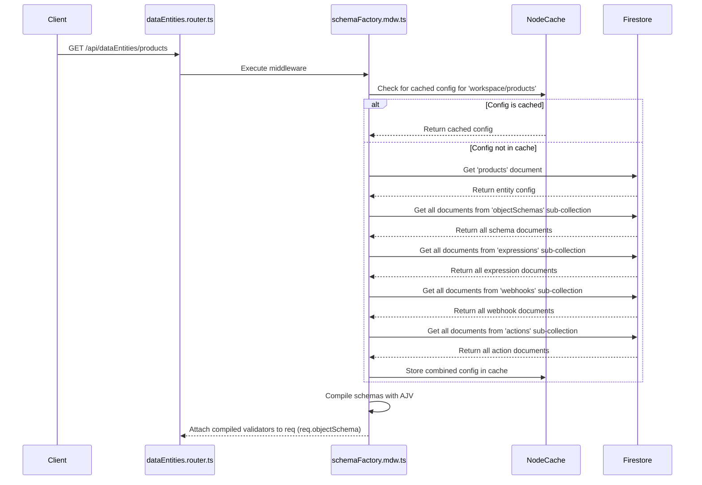

## Schema-Driven Core

The entire platform is built upon a dynamic, schema-driven architecture. Schemas are not just for validation; they are the central configuration that dictates how the API behaves for each data entity. This approach allows for the creation of new, fully-featured API endpoints without a single line of code change.

### How It Works

The magic happens in the `schemaFactory.mdw.ts` middleware, which is one of the first to run for any data entity route. It is responsible for loading all configurations related to an entity and compiling them for use during the request lifecycle.



### Custom Schema Keywords

To make schemas more powerful, we use custom keywords recognized by our AJV validator instance (`src/schemas/keywords.ts`).

* **`objectId: true`**: This marks a property as the unique identifier for documents in the collection. When creating a new object, the value of this field will be used as the Firestore Document ID. This is critical for creating predictable and idempotent `POST` operations. A schema can only have one `objectId`.

* **`searchable: true`**: Any property with this keyword will have its value included in the text that gets converted into a vector embedding by Vertex AI. When a document is created or updated, the values of all `searchable` fields are concatenated into a single string, which is then sent to the AI model. This is the foundation of our semantic search (`?contextSearch`).

* **`filter: true`**: This keyword designates a property as being available for exact-match filtering in `GET` requests. The `listDataEntityObjects.mdw.ts` middleware introspects the schema for these properties and will only build `where` clauses for query parameters that match a field marked as filterable.

**Example Schema Snippet:**
```json
{
  "$id": "product",
  "type": "object",
  "properties": {
    "sku": { "type": "string", "objectId": true },
    "name": { "type": "string", "searchable": true, "filter": true },
    "description": { "type": "string", "searchable": true },
    "brand": { "type": "string", "filter": true }
  },
  "required": ["sku", "name"]
}
```
In this example:
* `POST /api/dataEntities/products` with a body of `{"sku": "ABC-123", ...}` will create a document with the ID `ABC-123`.
* The `name` and `description` fields will be used to generate a vector embedding for semantic search.
* `GET /api/dataEntities/products?name=MyProduct&brand=MyBrand` is a valid query because both `name` and `brand` are marked as filterable. A query like `?description=test` would be ignored.

---
