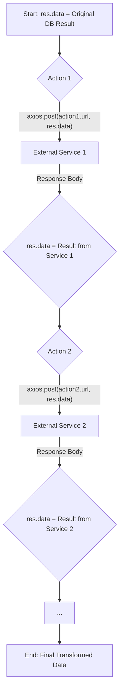

### Actions

Actions are more powerful and are designed for creating sequential data processing pipelines. They execute a defined chain of HTTP `POST` requests where the output of one request becomes the input for the next.

* **Mechanism**: The `actions.mdw.ts` middleware runs after the main database operation and after the `webhooks` middleware.
* **Logic**:
    1.  It retrieves the list of action configurations for the entity. Unlike webhooks, actions are always executed in a predefined order.
    2.  It uses a `for...of` loop to ensure sequential execution.
    3.  **Action 1**: It makes an `axios.post` request to the URL of the first action, using the current `res.data` as the request body.
    4.  The response body from Action 1 completely **replaces** `res.data`.
    5.  **Action 2**: It makes a `POST` request to the URL of the second action, using the *new* `res.data` (the output from Action 1) as its request body.
    6.  This process continues for all configured actions. The final state of `res.data` after the last action is what gets passed to the `respond` middleware and sent to the original client.

This powerful feature allows for complex orchestrations, like enriching data from multiple external APIs in a single, atomic operation from the client's perspective.
